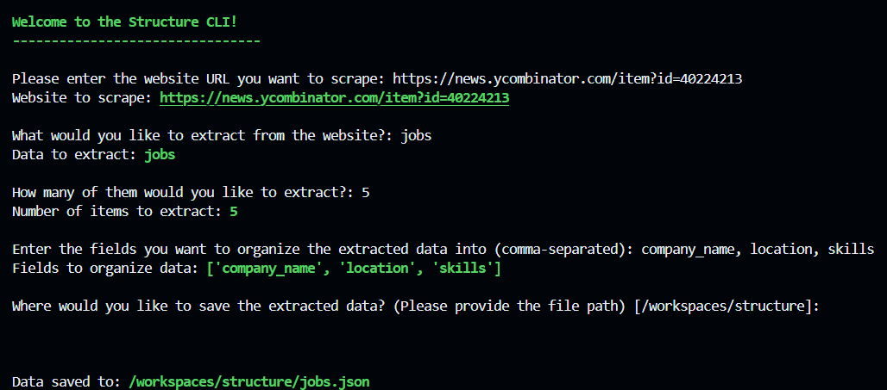

# Structure: CLI & API for Structured Data Scraping

This repository provides tools for scraping structured data from websites. It includes a FastAPI application for asynchronous web scraping through an API and a CLI tool for extracting and saving structured data from the command line.



## Contents

- `api.py`: A FastAPI application for processing web scraping requests asynchronously.
- `cli.py`: A command-line interface (CLI) tool for extracting and saving structured data from websites.

## Purpose

The tools in this repository are designed to:

- Scrape structured data from websites using specified extraction parameters.
- Process and save extracted data in a structured format for further use.

## Setup

### Prerequisites

- Python 3.8 or later
- Pip

### Installation

1. **Clone the Repository:**

   ```bash
   git clone https://github.com/DaveOkpa/structure.git
   cd structure
   ```

2. **Install Dependencies:**

   Install all the required Python packages by running `pip install -r requirements.txt`

## API Usage

The `api.py` file provides an HTTP endpoint for asynchronously processing web scraping tasks.

### Endpoint

`POST /process`

**Description:** Initiates the process of scraping and extracting structured data from a given webpage.

**Request Body:**

```json
{
  "url": "string",
  "prompt": "string",
  "fields": {
    "field_name": "field_type" // Available types: str, int
  },
  "xpath": "string (optional)"
}
```

**Response:**

```json
{
  "message": "Processing URL"
}
```

### Running the API

To start the FastAPI server (given FastAPI CLI is installed):

```bash
fastapi dev
```

The server will be available at `http://127.0.0.1:8000`.

## CLI Usage
The `cli.py` file provides a CLI tool for scraping and saving structured data.

### Running the CLI

Execute the CLI tool with:

```bash
python cli.py
```

Follow the interactive prompts to:

1. Enter the URL of the website you want to scrape.
2. Specify the type of data you wish to extract.
3. Indicate how many items you want to extract.
4. Define the fields for organizing the extracted data.
5. Choose the location to save the extracted data.

The tool will handle the extraction and save the data as a JSON file in the specified location.


## Example Workflow

### 1. Using the API

Given the API is running, you can run a request to server. Here's an example:

#### Sample Request

```bash
curl --location '127.0.0.1:8000/process/' \
--header 'Content-Type: application/json' \
--data-raw '{"url": "https://news.ycombinator.com/item?id=40224213",
"prompt": "Extract 20 jobs",
"xpath": "//div[@class='\''comment'\'']",
"fields": {
    "company_name": "str",
    "location": "str",
    "skills": "str",
    "contact": "str",
    "index": "int"
}
}'
```

#### Sample Server Response

```json
{"message":"Processing URL"}
```

#### Sample Background Task Response

```json
{
  "data": [
    {
      "company_name": "Internet Archive",
      "location": "Remote",
      "skills": "Web Crawlers, Preservation Services, Public Access Services",
      "contact": "https://app.trinethire.com/companies/32967-internet-archive/",
      "index": "1"
    },
    {
      "company_name": "Common Crawl Foundation",
      "location": "Remote",
      "skills": "Python, Java, Cloud Systems, Spark/PySpark",
      "contact": "jobs@commoncrawl.org",
      "index": "2"
    },
   
    // redacted output ...

  ]
}
```